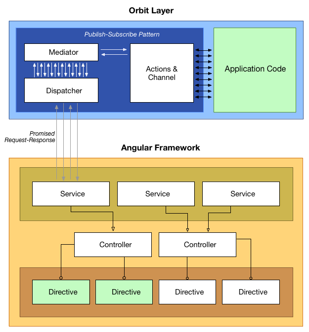

[]() []()

Orbit **v0.4.0**. Making the core of your application framework-independent.
<a name="index"></a>
## Index
- **[Installing](#installing)**
- **[Inspiration, fancy names](#inspiration)**
- **[MVC, Flux and other frameworks, the problem: Refactoring](#mvc)**
- **[What we propose](#proposal)**
- **[Structure](#structure)**
- **[React Example](#react)**
- **[Angular Example](#angular)**
- **[Wiki](https://github.com/hugeinc/orbit/wiki/)**
- **[Contributing](#contributing)**


<a name="installing"></a>
## Installing
- **Not yet** Run ```npm install orbit --save```
- Alternatively, download the [orbit/files/dist/orbit.js](https://github.com/hugeinc/orbit/blob/develop/files/orbit/dist/orbit.js) file and place it in your project.
- Orbit is under UMD. You can require, import it, or use it as a global variable

```javascript
const Orbit = require('vendor/orbit'); // or
import Orbit from 'vendor/orbit'; // or global variable
console.log(Orbit);

const actions = { ONE: 'ONE' };
const MyFeature = Orbit({...actions}).createModule();
const ReactComponent = Orbit(this).createActivator([MyFeature,...])
ReactComponent.addMiddleware([...]) // before and after middlwares
ReactComponent.request[actions.ONE]().then()

// You can add an additional proxy layer
const AngularService = Orbit(this).createProxy(MyFeature)
AngularService.addMiddleware([...]) // before and after middlwares
const AngularController = Orbit(this).createActivator([AngularService,...])
Directive.request[actions.ONE]().then()
```  
**[Back to top](#index)**

<a name="inspiration"></a>
## Inspiration, fancy names
We were inspired by those amazing tools and philosophies:
- [CSP](https://github.com/ubolonton/js-csp)
- [PostalJS](https://github.com/postaljs/postal.js)
- [EAI](https://en.wikipedia.org/wiki/Enterprise_application_integration)
- [ESB](https://en.wikipedia.org/wiki/Enterprise_service_bus)
- [EIP Messaging Patterns](http://www.enterpriseintegrationpatterns.com/patterns/messaging/index.html)
- [RabbitMQ](https://www.rabbitmq.com/)
- [AMQP.Node](http://www.squaremobius.net/amqp.node/)
- [Express Middlewares](http://expressjs.com/en/guide/writing-middleware.html)
- [Node Events](https://nodejs.org/dist/latest-v4.x/docs/api/events.html)

Why not have the decoupling strategy that already exists between Enterprise Applications, inside your own Single Applications, between your Business Logic and Frameworks? :)  
**[Back to top](#index)**

<a name="mvc"></a>
## MVC frameworks and the "opponent", the problem: Refactoring
Usual frameworks propose a good enough separation of concerns by the three major areas that we deal with:

- Data
- Logic
- User Interface

They get separated into Model Controller and View, which is far better than the mixed cake that we rarely see nowadays (hopefully). We can say that from bottom up, **code** change less, progressively: View changes a lot, Controller changes often and Models change rarely. Best case scenario those 3 are decoupled in a way we can reuse M, V and C. Often, we need to do parallel actions and mix Controllers features. That is when things get complicated.

Functional, Reactive programming and alike means a tremendous evolution compared to MVC, when regarding scaling and long-term projects. If you have a entrance point of data, you just transform or project it in the way you want, through functions until it gets rendered for the user. But the main concern we are trying to deal with here is still in place: Refactoring.
 
Refactoring is a reality, specially when developing big and long lasting applications. The benefits from Client-Side applications are very clear to us but the number of frameworks and their updates rain on us every week. We might feel tempted to test or do proof of concepts on different platforms, frameworks and philosophies but it seems too difficult. We can stay stuck into the same old application for years.  
**[Back to top](#index)**

<a name="proposal"></a>
## What we propose
We just have one concern here, the C of traditional MVC, the Angular's Service or Redux Reducer. They usually holds the Business Logic of your application -- what distinguish your product from others. Frameworks do have their role, and makes view rendering and model sincronization a lot easier. It would just be even easier for us if the Business Logic could be decoupled from tools and easily migrated when needed. So, use any framework or library you want, but keep your core code agnostic.

First, you should separate "framework-code" from "application-code". Frameworks should deal with HTTP requests, view/templaing/virtual-dom rendering, data synchronization and/or database integration if needed. Application should be just functions, pure functions in the best case scenario. Let's see an example.  
**[Back to top](#index)**

<a name="structure"></a>
## Structure

```
/client  
    /orbit  
    /angular
```

#### The orbit folder

```
/orbit
	/folder-by-feature
	/eg-home
	/simulator
```	

- Your files will host all functions related to a specific feature.
- Additionally, each feature have a set of public actions.
- If writting tests, add your .spec file in there too.

```
/orbit/home
	home.js
	home.spec.js
	actions.js
```

### The feature main file
You can divide this file into multiple modules as needed, but all functionalities should come into one file at the end.

Your file will look something like this:

```javascript
// Import your actions constant file
import Orbit from 'orbit';
import actions from './actions';

// Your core feature code, an object with pure functions
export default Orbit({
	// You can have private properties if you want
	title: 'Orbit',
	actions: actions,
	[actions.FORMAT_TITLE]: function(data) {
		return data + ' ' + this.title;
	},
	[actions.INCREMENT]: function(data) {
		return ++data;
	},
	[actions.DECREMENT]: function(data) {
		return --data;
	}
}).createModule();
```

### The actions file
Refactors happen all the time. In order to change your code in just one place we use actions constants that will set and get functions for you.
All public functions from the application that you want the framework to be able to access should have an action:

```javascript
export default {
	FORMAT_TITLE: 'FORMAT_TITLE',
	INCREMENT: 'INCREMENT',
	DECREMENT: 'DECREMENT'
};
``` 
**[Back to top](#index)**

<a name="react"></a>
## React Example
We know that React concerns only the V (sort of) of our apps. After you create an Orbit module, you should have an endpoint where you call it. This can be the Component it self.

```javascript
import Orbit from 'orbit';
import Home from 'orbit/home';

React.createClass({
	getInitialState() {
		return {
			title: ''
		}
	},
	componentDidMount() {
		var self = this;
		Orbit(this).createActivator([Home]);

		this.request[Home.actions.FORMAT_TITLE]('Welcome').then(function(data) {
			self.setState({
				title: data
			});
		}, function(err) {
			console.log('Error: ', err);
		});
	},
	render() {
		return (
			React.createElement('h1', null, this.state.title)
		);
	}
});
```  
**[Back to top](#index)**

<a name="angular"></a>
## Angular Example
The Angular team saw that M, V and C are not enough for code decoupling. They added a few extra things like Services, Factories and Providers. Whenever you have code that you will reuse in multiple places, put them into Services. This is very helpful but still coupled. Refactoring means changing your Service, Controller and Directive at least.

  
[Open full size version](images/OrbitLayer.pdf)


Let's assume that you consider the Angular Service the holder of logic. Controller the scope provider and the Directive where actions get fired. In the previous example we had your Orbit module and an Activator where you fire your actions. If you have/need a layer in between day you can create what we call Proxy. In Angular's architecture that would be in your Service.

```javascript
import Home from 'orbit/home';

// Service
// After .extend, the service can add middlewares
// And have the actions and methods built into itself
// through the Orbit factory
angular.module('app.home')
    .service('HomeService', HomeService);

function HomeService($http) {
    Orbit(this).createProxy(Home);

	// This is optional.
	// You might want to execute something before
	// your core code is run, or after.
	this.addMiddleware({
		action: Home.actions.FORMAT_TITLE,
		before: function(data) {
			// Orbit will send the Promise
			// result to your code.
		    return $http({
		        method: 'GET',
		        url: 'http://localhost:4000/posts'
		    });
		}
	});

	return this.service;
}

HomeService.$inject = ['$http'];
```
```javascript
// Controller
// The controller doesn't know about Orbit,
// it just uses the service.
// After .extend, it gets the methods bound into its scope.
angular.module('app.home')
    .controller('HomeController', HomeController);

function HomeController(HomeService) {
    var vm = this;
    
    vm.title = 'Hello.';

    Orbit(this).createActivator([HomeService]);
}

HomeController.$inject = ['HomeService'];
```
```javascript
// Page template
// We pass methods (request) to the directive.
header(title="vm.title", request="vm.request")
```
```javascript
// Directive
// The directive just calls the method which return a promise.
angular
    .module('app.header')
    .directive('header', HeaderDirective);

function HeaderDirective() {
    var directive = {
        templateUrl: '../components/header/header.html',
        link: function (scope, element, attr) {
            var actions = scope.actions;

            scope.getTitle = function(params) {
                scope.request[actions.FORMAT_TITLE](params).then(function(data) {
                    scope.title = data;
                    if (!scope.$root.$$phase) scope.$digest();
                }, function(err) {
                    console.log('Error: ', err);
                });
            }
        },
        scope: {
            title: '=',
            methods: '='
        },
        restrict: 'E'
    };

    return directive;
}

```

Want to know more? Head to the [wiki](https://github.com/hugeinc/orbit/wiki) to see API explanations, React, Backbone and other examples.  
**[Back to top](#index)**

<a name="contributing"></a>
## Contributing? Development instructions

* Install [Docker](https://docs.docker.com/mac/step_one/)*

```
$ make sdocker
```
Starts Docker default machine, if you are on Mac.

```
$ make setup
```
First time only image setup.

```
$ make up
```
Starts container. When the container starts you will have a live server for testing one of the examples; all the tests running in watch mode and bundle regeneration in watch mode.

See the **makefile** to see available commands such as unit, integration tests and others.  
**[Back to top](#index)**
