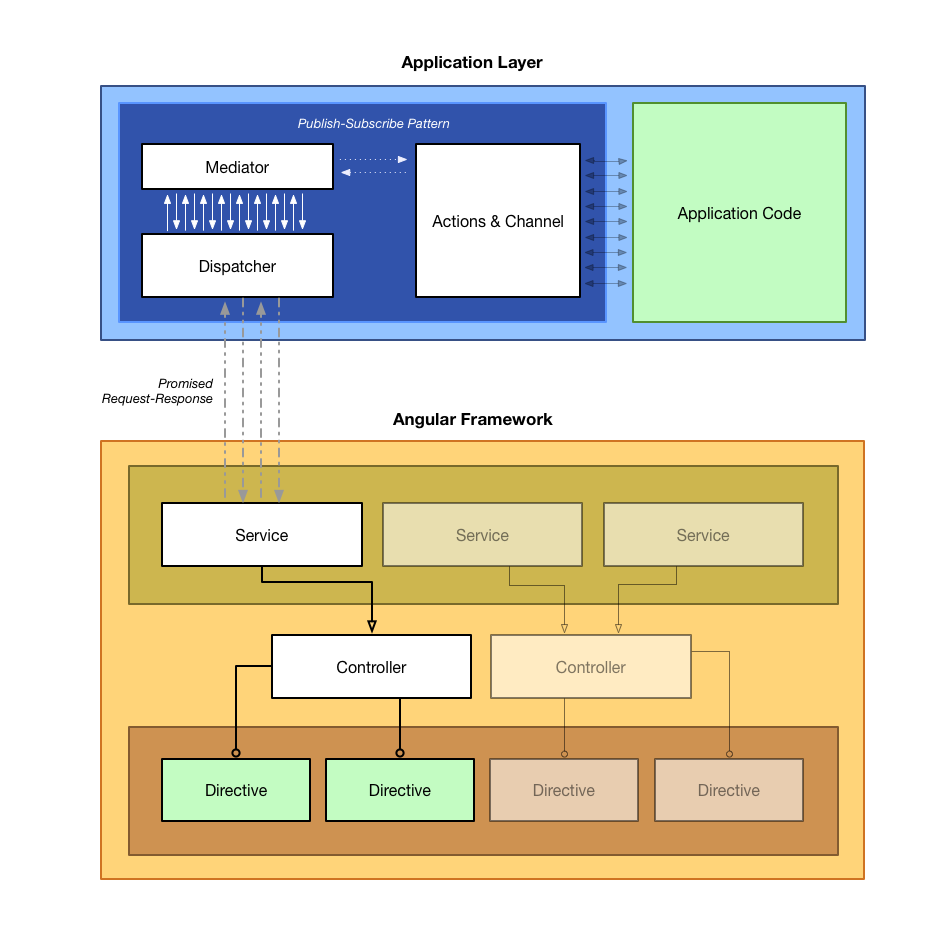

# Orbit
### v0.2.0
#### In process, merging repos...
The business logic of your app should be free of framework boundaries and specifications. In order to achieve that, your logic should be as stateless as possible and reside in a different layer. Read more for further instructions.

## Development

* Install [Docker](https://docs.docker.com/mac/step_one/)*
* Open the Launchpad and locate the Docker Quickstart Terminal icon and click it.*

If you are doing this for the first time:

```
$ make setup
```

Then:

```
$ make up
```

Executing commands:

```
docker exec orbit npm start
```


[Open full size version](images/ApplicationLayerGraph.pdf)

## Flow

### Setup
1- Your Application Code > ActionsCreator  
2- Your Application Code > Orbit.Class > which calls: Mediator  

### Trigger (decoupled)
1- Your View Code > ViewProvider > which calls: ActionEmitter > which calls: Mediator > which calls: Class (Your Application Code)  
2- And goes back: Mediator > ActionEmitter > ViewProvider > Your View Code  

### Trigger (coupled)
1- Your View Code > Dispatcher (ViewProvider + ActionEmitter) > which calls: Mediator > which calls: Class (Your Application Code)  
2- And goes back: Mediator > Dispatcher > Your View Code  


Example structure:  

```
/client  
    /orbit  
    /angular
```

## The orbit folder
Inside the orbit folder you will find the core folder and your own custom folder, by feature.

```
/orbit
	/core
	/folder-by-feature
	/eg-home
	/simulator
```	

- Your files will host all functions related to a specific feature.
- Additionally, each feature have a set of public actions.
- If writting tests, add your .spec file in there too.

```
/orbit/home
	home.js
	home.spec.js
	actions.js
```

### The feature main file
You can divide this file into multiple modules as needed, but all functionalities should come into one file at the end.

Your file will look something like this:

```
define('Home', ['orbit/core', './actions'], function(Orbit, actions) {
	var props = {},
		methods = {};

	props.title = 'Hello.';

	methods.privateMethod = function() {
		this.anotherPrivateMethod();
	};

	methods.anotherPrivateMethod = function() {
		console.log('privateMethod called anotherPrivateMethod');
	};

	methods[actions.GET_TITLE] = function(data) {
		// You can modify, return data or throw error.

		return this.title + ' | ' + data;
	};

	return Orbit.Class.extend({
		props: props,
		methods: methods,
		actions: actions
	});
});
```

### The actions file
Refactors happen all the time. In order to change your code in just one place we use actions constants that will set and get functions for you.
All public functions from the application that you want the framework to be able to access should have an action:

```
define('actions', function() {
   return {
       GET_TITLE: 'FetchTitleFromServer'
   };
});
```


## The framework folder
Put yout framework of choice code inside a separate folder.

How do you use the application logic safely inside the framework?

**Example:**  
If using React, just extend the Orbit.Dispatcher factory with the actions you want.

```
var App = React.createClass({
	dispatcher: function() {
		_.extend(this, Orbit.Dispatcher(Home.actions));
	},
	getInitialState: // ...
	componentDidMount: function() {
		var self = this;
		this.dispatcher();

		this.methods[this.actions.GET_TITLE]().then(function(data) {
            self.setState({
            	title: data
            });
        }, function(err) {
            console.log('Error: ', err);
        });
	},
	render: // ...
});

```

**Example:**  
Using Backbone:

```
// Our model
var Greeting = Backbone.Model.extend({ 
    initialize: function () {
        var model = this;
        _.extend(this, Orbit.ActionEmitter.extend(Home.actions));

        this.addMiddleware({
            action: Home.actions.GET_TITLE,
            after: function(data) {
                model.set({'text': data});
            }
        });
    },
    defaults: { text: '' } 
});

// Our view
var GreetingView = Backbone.View.extend({
    initialize: function() {
        _.extend(this, Orbit.ViewProvider.extend([this.model.service]));

        this.listenTo(this.model, 'change', this.render);
        this.methods[Home.actions.GET_TITLE]();
    },
    render: function() {
        this.$el.html(this.template({
            text: this.model.get('text');
        }));
    }
});
```

Ok, what happened? Because you are delegating the logic to the Orbit layer, you might want to manipulate/use the data in three moments:

- Right before the data gets to the Orbit layer
- Right after the data comes
- When setting the data in the view

So far we found that depending on the framework, you might do that all in one place or in two places:

- If your framework have stronger separation of concerns, you might have a separating between: Model/View and Service/Directive for example
- All in one place, like on a React component

**Example:**   
Manipulating the data in one place:

```
var App = React.createClass({
	dispatcher: function() {
		_.extend(this, Orbit.Dispatcher(Home.actions, [
			{
				action: Home.actions.GET_TITLE,
				before: function(data) {
					return 'Before sending the data ' + data;
				},
				after: function(data) {
					return 'After getting the data and before setting state ' + data;
				}
			}
		]));
	},
	getInitialState: // ...
	componentDidMount: function() {
		var self = this;
		this.dispatcher();

		this.methods[this.actions.GET_TITLE]().then(function(data) {
            self.setState({
            	title: data
            });
        }, function(err) {
            console.log('Error: ', err);
        });
	},
	render: // ...
});

```

**Example:**  
Manipulating the data in two places (the same Backbone example as before):

```
// Our model
var Greeting = Backbone.Model.extend({ 
    initialize: function () {
        var model = this;
        _.extend(this, Orbit.ActionEmitter.extend(Home.actions));

        this.addMiddleware({
            action: Home.actions.GET_TITLE,
            after: function(data) {
                model.set({'text': data});
            }
        });
    },
    defaults: { text: '' } 
});

// Our view
var GreetingView = Backbone.View.extend({
    initialize: function() {
        _.extend(this, Orbit.ViewProvider.extend([this.model.service]));

        this.listenTo(this.model, 'change', this.render);
        this.methods[Home.actions.GET_TITLE]();
    },
    render: function() {
        this.$el.html(this.template({
            text: this.model.get('text');
        }));
    }
});
```

## ActionEmitter and ViewProvider
I think you saw those names in the previous example. How does all of this work?

The Orbit basically does:

- Separate your public methods into actions
- Create a class of your feature methods, subscribing all action methods into a Pub/Sub promise system
- Offer a way of adding middlewares to each action promise with before and after methods
- Provide the methods to your view

The first item from that list is your task. The other three can be divided into:

**ActionEmitter:**

- Create a class of your feature methods, subscribing all action methods into a Pub/Sub promise system
- Offer a way of adding middlewares to each action promise with before and after methods

**ViewProvider:**

- Provide the methods to your view

When everything is done in just one place, both ActionEmitter and ViewProvider comes together into the Dispatcher (like the React example).

PS: Any error that occurs anywhere from the promise until your view will be catch into the error callback.

**An Angular example:**  
Let's assume that you consider the Angular Service the holder of logic, Controller the scope provider and the Directive where actions get fired.

```  
// Service
// After .extend the service can add middlewares
// And have the actions and methods built into itself
// through the Orbit factory
angular.module('app.home')
    .service('HomeService', HomeService);

function HomeService($http) {
    angular.extend(this, Orbit.Service.extend(Home.actions));

    this.addMiddleware({
        action: Home.actions.GET_TITLE,
        before: function(data) {
             return $http({
                 method: 'GET',
                 url: 'http://localhost:4000/posts'
             });
            // throw 'pééé';
            return 'bla ' + data;
        }
    });

    return this.service;
}

HomeService.$inject = ['$http'];
```
```
// Controller
// The controller doesn't know about the Orbit,
// it just uses the service.
// After .extend it gets the actions and methods bound into its scope.
angular.module('app.home')
    .controller('HomeController', HomeController);

function HomeController(HomeService) {
    var vm = this;
    
    vm.title = 'Hello.';

    angular.extend(this, Orbit.Controller.extend([HomeService]));
}

HomeController.$inject = ['HomeService'];
```
```
// Page template
// We pass actions and methods to the directive.
bv-header(title="vm.title", actions="vm.actions", methods="vm.methods")
```
```
// Directive
// The directive just calls the method which return a promise.
angular
    .module('app.header')
    .directive('bvHeader', HeaderDirective);

function HeaderDirective() {
    var directive = {
        templateUrl: '../components/header/header.html',
        link: function (scope, element, attr) {
            var actions = scope.actions;

            scope.getTitle = function(params) {
                scope.methods[actions.GET_TITLE](params).then(function(data) {
                    scope.title = data;
                    if (!scope.$root.$$phase) scope.$digest();
                }, function(err) {
                    console.log('Error: ', err);
                });
            }
        },
        scope: {
            title: '=',
            actions: '=',
            methods: '='
        },
        restrict: 'E'
    };

    return directive;
}

```
